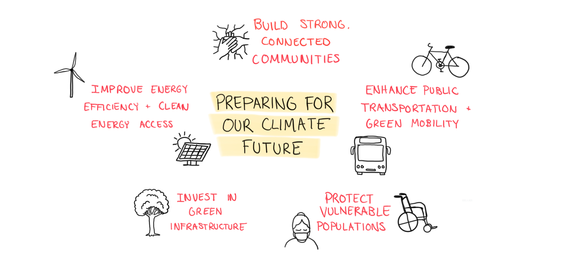

## Mitigation vs Adaptation

**Mitigation** aims to *reduce the causes of climate change* by lowering greenhouse gas emissions and enhancing carbon sinks. Examples of mitigation projects include transitioning to renewable energy, improving energy efficiency, and reforesting degraded land.

**Adaptation** focuses on *managing the impacts of climate change* by increasing resilience to its effects and adjusting current living conditions to be better equipped for the climate in the future. This includes building flood defenses, developing drought-resistant crops, and improving urban infrastructure to handle extreme weather.

## Mitigation Strategies

Cities across the Midwest are stepping up their climate action with ambitious projects and policies aimed at reducing greenhouse gas emissions and embracing renewable energy.

-   [Madison, Wisconsin](https://www.cityofmadison.com/sustainability/climate/sustainability-plan), for example, supports local wind energy production, with approximately 10,000 residential customers already on green energy, as part of its goal to achieve 100% renewable energy for municipal electricity.

-   [Columbus, Ohio](https://smartcolumbus.com/playbook-assets/electric-vehicle-fleet-adoption/making-it-simple-for-columbus-region-municipalities-to-electrify-their-fleets), has become a national leader in transitioning municipal fleets to electric vehicles, with nearly 100 EVs in use and plans to add 200 more, alongside anti-idling technology to cut emissions.

-   [Grand Rapids, Michigan](https://www.grandrapidsmi.gov/Government/Departments/Sustainability), is developing a roadmap to achieve a zero net carbon building sector by 2050, joining Michigan’s Battle of the Buildings initiative to enhance energy efficiency across commercial, industrial, and multi-family buildings.

-   [Ann Arbor, Michigan](https://www.a2gov.org/departments/sustainability/documents/a2zero%20climate%20action%20plan%20_3.0.pdf), plans to reduce greenhouse gas emissions by 25% by 2025 and 90% by 2050, offering low-interest funding for property owners and renters to assess and upgrade building efficiency.

-   In June 2024, the [Minnesota House of Representatives](https://www.house.mn.gov/members/Profile/News/15513/39463) passed a 2024 Climate and Energy Bill, which allocates \$14.2 million for renewable energy projects, \$1 million for geothermal and solar, and streamlines permitting to support the state’s 100% clean energy goal by 2040.

-   [Cincinnati, Ohio](https://insights.cincinnati-oh.gov/stories/s/Emissions-Greenhouse-Gases/d49x-hx36/), has already saved roughly 150,000 metric tons of CO2 through municipal building efficiency improvements and has created the [Green Cincinnati Plan](https://app.climateview.global/v3/public/board/eaf363ce-0ad5-4d27-b686-4ee5ea070149), a "comprehensive set of 40 high-impact Strategies and 128 Actions to address climate change and build a more sustainable, equitable, and resilient future."

Beyond local efforts, the Midwest states of Minnesota, Illinois, and Michigan have passed laws to expedite renewable energy projects, addressing a significant backlog of solar, wind, and battery projects awaiting grid connection. Michigan’s [2023 legislation](https://graham.umich.edu/project/MI-energy-siting) streamlined the approval process for large renewable energy projects by centralizing authority at the state level, while [Minnesota’s reforms](https://mn.gov/governor/newsroom/press-releases/?id=1055-630240#:~:text=Reforms%20are%20estimated%20to%20result,percent%20clean%20electricity%20by%202040.) are expected to reduce permitting times by up to nine months, helping bring clean energy online faster. Together, these efforts highlight the region’s commitment to advancing climate solutions and renewable energy innovation.

## Adaptation Strategies

-   [Midwest Climate Hub](https://fundingtoaction.edf.org/?casestudy=midwest-climate-hub): The Midwest Climate Hub helps agricultural communities across eight states adapt to climate change by providing region-specific climate data, conducting research, and developing adaptive technologies. The Hub collaborates with local partners to ensure that climate information reaches farmers and is applied effectively.

-   [Space to Grow (Chicago)](https://www.spacetogrowchicago.org/): The Space to Grow initiative transforms school parking lots in low-income neighborhoods into green infrastructure that captures stormwater and reduces flooding risks. These spaces also serve as educational and community gathering areas, promoting social engagement, physical activity, and environmental education while benefiting the community.

-   [Evanston, Illinois Climate Plan](Evanston's climate plan): Evanston’s climate action plan focuses on helping vulnerable communities, such as low-income populations and communities of color, adapt to climate change. The city offers energy efficiency upgrades, develops funding programs, and works with residents to reduce financial impacts and promote environmental justice.

-   [Midwest Climate Adaptation Science Center](https://mwcasc.umn.edu/our-approach): The Midwest Climate Adaptation Science Center conducts research to provide science-based solutions for adapting to climate change. It supports fish, wildlife, water, land, and communities in the Midwest by offering localized information and decision-making tools.

-   [Thrive Indianapolis:](https://www.thriveindianapolis.com/) Thrive Indianapolis is a sustainability plan that targets climate change impacts on low-income and marginalized communities. The plan includes eliminating barriers to energy efficiency programs and offering financing for home energy upgrades, ensuring that vulnerable populations can reduce their energy costs while improving resilience.

-   [Edina, Minnesota Energy Action Plan](https://arc.net/l/quote/ykxkuldn): Edina’s Energy Action Plan emphasizes energy efficiency with strong monitoring and reporting. The city tracks progress through bi-weekly meetings with stakeholders, ensuring transparency and flexibility to adjust strategies if needed, and focuses on residential and commercial energy efficiency improvements.

-   [Sustainable Chicago](https://www.chicago.gov/city/en/progs/env/sustainable_chicago2015.html): Chicago’s climate resilience efforts include expanding green infrastructure, modernizing the sewer system, and increasing urban parks to reduce flooding and heat risks. The city also operates cooling centers during heatwaves and promotes transportation equity through its Divvy bike-share program.

-   [St. Paul Climate Action](https://www.stpaul.gov/departments/mayors-office/climate-action-planning): St. Paul’s climate action plan engages vulnerable communities in developing strategies for resilience. The city emphasizes social engagement, with initiatives like urban gardening, sustainable transportation, and climate education to help communities adapt to climate change and promote equity. The Community Climate Change Conversations project focuses on grassroots resilience building.

While the challenges posed by climate change are significant, there are many dedicated individuals, organizations, and communities already working to adapt and build resilience. **Through collaborative efforts, strategic planning, and focused action, we can create more robust, sustainable, and protected communities for the future**, and by learning from current initiatives and continuously improving our approaches, we can better equip vulnerable populations and foster long-term climate resilience.
