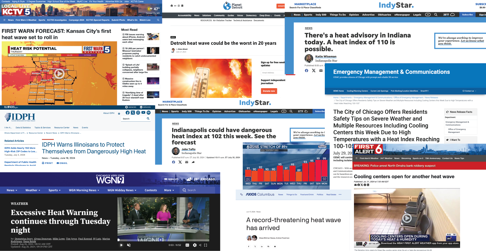

<link rel="preconnect" href="https://fonts.googleapis.com"> <link rel="preconnect" href="https://fonts.gstatic.com" crossorigin> <link href="https://fonts.googleapis.com/css2?family=Oswald:wght@700&display=swap" rel="stylesheet">

# Introduction

Midwesterners don't think climate change is an issue facing them.

In [surveys](https://climatecommunication.yale.edu/visualizations-data/ycom-us/), most Midwestern states show lower-than-national-average rates of people who "believe global warming is happening" and are "worried about global warming." Additionally, scores for the belief that "global warming will harm me personally" are much lower across the Midwest compared to other states.

It makes sense when you think about it: many Midwesterners don't visibly face rising sea levels or increasing storm intensity. We don't experience huge flooding events from hurricanes or massive wildfires like areas with large forests.

**For Midwesterners, the main concern about climate change is increasing temperatures. We're likely to have both hotter days than in previous years and more of those hot days overall.**

There are obvious [agricultural concerns](https://www.ers.usda.gov/amber-waves/2024/march/ers-research-models-future-effects-of-climate-change-on-corn-and-soybean-yields-production-and-exports/#) impacting the Midwest, as corn and soybeans make up 75% of farmland. The corn market is projected to slow in yield growth, while soybean growth is projected to actually decrease.

This impacts people on a personal level as well. Exposure to heat increases the likelihood of **heat stress**—a condition where the body is unable to effectively regulate its temperature due to excessive environmental heat exposure.

Heat stress is the [leading cause](https://www.who.int/news-room/fact-sheets/detail/climate-change-heat-and-health) of weather-related deaths. It can exacerbate underlying illnesses including cardiovascular disease, diabetes, mental health conditions, and asthma. It can also increase the risk of accidents and transmission of some infectious diseases.

Heat stress is likely to increase as temperatures and humidity continue to rise in this region, resulting in **more heat-related deaths and illnesses**.

In the United States, [mortality increases](https://nca2014.globalchange.gov/report/regions/midwest) 4% during heat waves compared with non-heat wave days. Heat-related mortality for people over 65 years of age [also increased](https://www.who.int/news-room/fact-sheets/detail/climate-change-heat-and-health) by approximately 85% between 2000–2004 and 2017–2021.

```{r setup, include=FALSE}
knitr::opts_chunk$set(echo = TRUE)
options(scipen=999) #prevent it from using scientific notation when knitting html

library(tidyverse)
library(ggplot2)
library(readr)

library(plotly)

library(RColorBrewer)

```

```{r read in data, include=FALSE}

climate_data <- read_csv("climate-data.csv", 
    col_types = cols(loc_id = col_character()))
#View(climate_data)

cities <- c("Kansas City", "Omaha", "Minneapolis", "Louisville", 
            "Chicago", "Indianapolis", "Milwaukee", "Cincinnati", 
            "Columbus", "Detroit", "Cleveland")
hazards <- c("Tmax95pctl_days", "Tmax40_days", "Tmax35_days", 
             "Twb31_days", "heatwave_duration", "heatwave_count", "drought_days")

climate_data <- climate_data %>%
  filter(city %in% cities, hazard %in% hazards)

# CONVERT SCENARIOS TO FACTOR 
climate_data$scenario <- factor(
  climate_data$scenario,
  levels = c("1995 - 2014", "1.5C", "2.0C", "3.0C")
)

levels(climate_data$scenario)[levels(climate_data$scenario) == "1995 - 2014"] <- "Historical"

```

# News Stories

It's easy to envision the hypothetical impact of rising temperatures — yet we can already see the real effects in communities across the Midwest.



Cooling centers are often opened to support at-risk communities and safeguard vulnerable populations from heat stroke.

The rise in heat waves is also evident in social media posts from local National Weather Service accounts. These posts aim to inform and prepare communities, offering a journalistic perspective on notifications and the history of heat waves impacting the Midwest.

```{r echo=FALSE,out.width="19%", out.height="20%",fig.cap="Tweets from local NWS Twitter Accounts",fig.show='hold',fig.align='center'}

knitr::include_graphics(c("images/indy2.png", "images/indy.png","images/kansascity.png", "images/chicago.png", "images/northernin.png"))

```

# Increasing Temperatures

In a dataset from the World Resources Institute, we can see the impact of various levels of warming on temperature projections for cities in the Midwest. This dataset examines a variety of climate hazards (defined as "a defined meteorological condition that without mitigation causes or exacerbates a negative societal impact") on cities across the world. The Midwest cities included are Kansas City, Omaha, Minneapolis, Louisville, Chicago, Indianapolis, Milwaukee, Cincinnati, Columbus, Detroit, and Cleveland.

The models produce a variety of different warming scenarios and what they call 'center point years' that identify a year for when that level of warming will be achieved.

```{r echo=FALSE, out.width="49%",fig.cap="Center Point Years from WRI Data",fig.show='hold',fig.align='center'}

knitr::include_graphics(c("images/centerpoint_2.png", "images/centerpoint.png"))

```

Some models already have us as passing the first threshold (1.5ºC) and predict that we will pass the second threshold (2.0ºC) by 2024. The final threshold listed (3.0ºC) lists a variety of years, with a range of years between as soon as 2028 and as late as 2086 for other models.

## 35ºC Threshold {.tabset}

An important indicator to consider is the threshold of 35°C (95°F).

The metric `Tmax35_days` represents the annual count of days with maximum temperatures reaching or exceeding 35°C, or 95°F. This temperature threshold is widely regarded as a critical limit for human tolerance, as prolonged exposure to humid conditions at or above 35°C can be life-threatening.

By comparing different warming scenarios, we can evaluate the potential impacts on cities in the Midwest.

### Recent Historical (1995 - 2014)

```{r chart 1 - recent hist, fig.width=8, fig.height=6}

chart1_35_data <- climate_data %>%
  filter(hazard == "Tmax35_days", indicator == "expectedvalue")

chart1_35_data_hist <- chart1_35_data %>%
  filter(scenario == "Historical")
chart1_35_data_1 <- chart1_35_data %>%
  filter(scenario == "1.5C")
chart1_35_data_2<- chart1_35_data %>%
  filter(scenario == "2.0C")
chart1_35_data_3<- chart1_35_data%>%
  filter(scenario == "3.0C")

# Get state boundary data
states_map <- map_data("state")

# Define latitude and longitude bounds for the Midwest region
midwest_bounds <- list(
  xlim = c(-100, -80), # Longitude bounds
  ylim = c(35, 50)     # Latitude bounds
)


# Create the map visualization

ggplot() +
  # Add state boundaries
  geom_polygon(data = states_map, aes(x = long, y = lat, group = group), 
               fill = "gray80", color = "white", size = 0.2) +
  # Add city bubbles
  geom_point(data = chart1_35_data_hist, 
             aes(x = longitude, y = latitude, size = mean_estimate, 
                 fill = round(mean_estimate), 
                 color = round(mean_estimate)), # Match fill and color
             alpha = 0.6, shape = 21, stroke = 1) + # Stroke for outline thickness
  scale_size_continuous(
    name = "Days over 35ºC", 
    range = c(1, 17) # Increase bubble size range
  ) +
  scale_fill_distiller(
    name = "Rounded Days", 
    palette = "YlOrRd", # Use Brewer's yellow-to-red palette
    direction = 1 # Ensure colors go from yellow (low) to red (high)
  ) +
  scale_color_distiller(
    name = "Rounded Days", 
    palette = "YlOrRd", # Match Brewer's palette for outline
    direction = 1 # Ensure colors match fill
  ) +
  coord_fixed(xlim = midwest_bounds$xlim, ylim = midwest_bounds$ylim) + # Zoom to Midwest
  labs(
    title = "Days Over 35ºC Across Midwest Cities - Recent Historical",
    subtitle = "Bubble size and color represent days over 35ºC"
  ) +
  theme_minimal() +
  theme(
    strip.text = element_text(size = 12), # Customize facet labels
    legend.position = "right", # Position legends to the right
    axis.title = element_blank(), # Remove axis titles
    axis.text = element_blank(),  # Remove axis text
    axis.ticks = element_blank(), # Remove axis ticks
    panel.grid = element_blank()  # Remove gridlines
  )


```

### 1.5ºC Warming

```{r chart 2 - 1.5C warming, fig.height=6, fig.width=8}
# Create the map visualization
ggplot() +
  # Add state boundaries
  geom_polygon(data = states_map, aes(x = long, y = lat, group = group), 
               fill = "gray80", color = "white", size = 0.2) +
  # Add city bubbles
  geom_point(data = chart1_35_data_1, 
             aes(x = longitude, y = latitude, size = mean_estimate, 
                 fill = round(mean_estimate), 
                 color = round(mean_estimate)), # Match fill and color
             alpha = 0.6, shape = 21, stroke = 1) + # Stroke for outline thickness
  scale_size_continuous(
    name = "Days over 35ºC", 
    range = c(1, 17) # Increase bubble size range
  ) +
  scale_fill_distiller(
    name = "Rounded Days", 
    palette = "YlOrRd", # Use Brewer's yellow-to-red palette
    direction = 1 # Ensure colors go from yellow (low) to red (high)
  ) +
  scale_color_distiller(
    name = "Rounded Days", 
    palette = "YlOrRd", # Match Brewer's palette for outline
    direction = 1 # Ensure colors match fill
  ) +
  coord_fixed(xlim = midwest_bounds$xlim, ylim = midwest_bounds$ylim) + # Zoom to Midwest
  labs(
    title = "Days Over 35ºC Across Midwest Cities - 1.5ºC Warming",
    subtitle = "Bubble size and color represent days over 35ºC"
  ) +
  theme_minimal() +
  theme(
    strip.text = element_text(size = 12), # Customize facet labels
    legend.position = "right", # Position legends to the right
    axis.title = element_blank(), # Remove axis titles
    axis.text = element_blank(),  # Remove axis text
    axis.ticks = element_blank(), # Remove axis ticks
    panel.grid = element_blank()  # Remove gridlines
  )

```

### 2ºC Warming

```{r chart 3 - 2C warming, fig.height=6, fig.width=8}
# Create the map visualization
ggplot() +
  # Add state boundaries
  geom_polygon(data = states_map, aes(x = long, y = lat, group = group), 
               fill = "gray80", color = "white", size = 0.2) +
  # Add city bubbles
  geom_point(data = chart1_35_data_2, 
             aes(x = longitude, y = latitude, size = mean_estimate, 
                 fill = round(mean_estimate), 
                 color = round(mean_estimate)), # Match fill and color
             alpha = 0.6, shape = 21, stroke = 1) + # Stroke for outline thickness
  scale_size_continuous(
    name = "Days over 35ºC", 
    range = c(1, 17) # Increase bubble size range
  ) +
  scale_fill_distiller(
    name = "Rounded Days", 
    palette = "YlOrRd", # Use Brewer's yellow-to-red palette
    direction = 1 # Ensure colors go from yellow (low) to red (high)
  ) +
  scale_color_distiller(
    name = "Rounded Days", 
    palette = "YlOrRd", # Match Brewer's palette for outline
    direction = 1 # Ensure colors match fill
  ) +
  coord_fixed(xlim = midwest_bounds$xlim, ylim = midwest_bounds$ylim) + # Zoom to Midwest
  labs(
    title = "Days Over 35ºC Across Midwest Cities - 2.0ºC Warming",
    subtitle = "Bubble size and color represent days over 35ºC"
  ) +
  theme_minimal() +
  theme(
    strip.text = element_text(size = 12), # Customize facet labels
    legend.position = "right", # Position legends to the right
    axis.title = element_blank(), # Remove axis titles
    axis.text = element_blank(),  # Remove axis text
    axis.ticks = element_blank(), # Remove axis ticks
    panel.grid = element_blank()  # Remove gridlines
  )

```

### 3ºC Warming

```{r chart 4 - 3C warming, fig.height=6, fig.width=8}
# Create the map visualization
ggplot() +
  # Add state boundaries
  geom_polygon(data = states_map, aes(x = long, y = lat, group = group), 
               fill = "gray80", color = "white", size = 0.2) +
  # Add city bubbles
  geom_point(data = chart1_35_data_3, 
             aes(x = longitude, y = latitude, size = mean_estimate, 
                 fill = round(mean_estimate), 
                 color = round(mean_estimate)), # Match fill and color
             alpha = 0.6, shape = 21, stroke = 1) + # Stroke for outline thickness
  scale_size_continuous(
    name = "Days over 35ºC", 
    range = c(1, 17) # Increase bubble size range
  ) +
  scale_fill_distiller(
    name = "Rounded Days", 
    palette = "YlOrRd", # Use Brewer's yellow-to-red palette
    direction = 1 # Ensure colors go from yellow (low) to red (high)
  ) +
  scale_color_distiller(
    name = "Rounded Days", 
    palette = "YlOrRd", # Match Brewer's palette for outline
    direction = 1 # Ensure colors match fill
  ) +
  coord_fixed(xlim = midwest_bounds$xlim, ylim = midwest_bounds$ylim) + # Zoom to Midwest
  labs(
    title = "Days Over 35ºC Across Midwest Cities - 3.0ºC Warming",
    subtitle = "Bubble size and color represent days over 35ºC"
  ) +
  theme_minimal() +
  theme(
    strip.text = element_text(size = 12), # Customize facet labels
    legend.position = "right", # Position legends to the right
    axis.title = element_blank(), # Remove axis titles
    axis.text = element_blank(),  # Remove axis text
    axis.ticks = element_blank(), # Remove axis ticks
    panel.grid = element_blank()  # Remove gridlines
  )

```

##  {.unlisted .unnumbered}

Most of the maps reveal at least one additional day exceeding 95°F under higher warming scenarios.

This trend is very clear in the 2.0°C and 3.0°C warming scenarios, with the most drastic effects observed in southern cities such as Kansas City, Omaha, Louisville, and Cincinnati.

Notably, Minneapolis stands out with a significant increase under extreme models, matching levels seen in cities like Chicago and Louisville, which are located much further south.

```{r table - increase in 35c by city}

# Group by city and scenario, calculate average mean_estimate
average_temp_days <- chart1_35_data %>%
  group_by(city, scenario) %>%
  summarize(average_days = mean(mean_estimate, na.rm = TRUE), .groups = "drop")

# Pivot data to have scenarios as columns
pivoted_temp_days <- average_temp_days %>%
  pivot_wider(
    names_from = scenario,
    values_from = average_days
  )

# Calculate the increase relative to "recent historical"
pivoted_temp_days <- pivoted_temp_days %>%
  mutate(
    `1.5C Increase` = `1.5C` - `Historical`,
    `2.0C Increase` = `2.0C` - `Historical`,
    `3.0C Increase` = `3.0C` - `Historical`
  )

# Round data 
pivoted_temp_days <- pivoted_temp_days %>%
  mutate(across(where(is.numeric), ~ round(., 2)))


knitr::kable(
  pivoted_temp_days %>% 
    select(city, `Historical`, `1.5C Increase`, `2.0C Increase`, `3.0C Increase`)
)
```

Clearly, these high temperatures are dangerous and likely to cause heatstroke or heat stress in people.

Different regions have varying levels of adaptation to hot weather. What insights can we gain by comparing the model's output to local temperature norms?

## Local Maximum Temperatures

Considering local temperature maximums is critical when examining climate change models, as communities are often adapted to their historical climate patterns. Infrastructure, public health systems, and daily life are built around these norms, meaning that even modest deviations from local temperature thresholds can have outsized impacts.

The indicator `Tmax95pctl_days` measures the annual number of days when the daily high temperature meets or exceeds the 95th percentile for a given location, based on a 40-year baseline (1980–2019). By focusing on locally defined extremes, this metric highlights the potential for disruption when temperatures exceed what residents and infrastructure are prepared to handle.

```{r table - increase in 95th pct by city}

chart2_95_data <- climate_data %>%
  filter(hazard == "Tmax95pctl_days", indicator == "expectedvalue")

# Group by city and scenario, calculate average mean_estimate
average_95temp_days <- chart2_95_data %>%
  group_by(city, scenario) %>%
  summarize(average_95temp_days = mean(mean_estimate, na.rm = TRUE), .groups = "drop")

# Pivot data to have scenarios as columns
pivoted_95temp_days <- average_95temp_days %>%
  pivot_wider(
    names_from = scenario,
    values_from = average_95temp_days
  )

# Calculate the increase relative to "recent historical"
pivoted_95temp_days <- pivoted_95temp_days %>%
  mutate(
    `1.5C Increase` = `1.5C` - `Historical`,
    `2.0C Increase` = `2.0C` - `Historical`,
    `3.0C Increase` = `3.0C` - `Historical`
  )

# Round data 
pivoted_95temp_days <- pivoted_95temp_days %>%
  mutate(across(where(is.numeric), ~ round(., 2)))


knitr::kable(
  pivoted_95temp_days %>% 
    select(city, `Historical`, `1.5C Increase`, `2.0C Increase`, `3.0C Increase`)
)
```

This table highlights the significant increases in the number of extreme heat days per city, with some locations experiencing **nearly two additional weeks of days exceeding the local 95th percentile** at the most extreme warming scenarios.

```{r chart - 95 pctile increase by scenario, fig.width=12, fig.height=6}

bubble_data <- pivoted_95temp_days %>%
  left_join(chart2_95_data %>% select(city, latitude, longitude) %>% distinct(), by = "city") %>%
  pivot_longer(
    cols = c("1.5C Increase", "2.0C Increase", "3.0C Increase"),
    names_to = "scenario",
    values_to = "increase"
  )


# Create the faceted map
ggplot() +
  # Add state boundaries
  geom_polygon(data = states_map, aes(x = long, y = lat, group = group), 
               fill = "gray85", color = "white", size = 0.2) +
  # Add city bubbles sized by the increase in days
  geom_point(data = bubble_data, 
             aes(x = longitude, y = latitude, size = increase, 
                 fill = round(increase), 
                 color = round(increase)), # Match fill and color
             alpha = 0.7, shape = 21, stroke = 0.8) + # Adjust transparency and outline
  scale_size_continuous(
    name = "Increase in Days", 
    range = c(0, 12) # Adjust bubble size for better differentiation
  ) +
  scale_fill_distiller(
    name = "Increase", 
    palette = "YlOrRd", 
    direction = 1
  ) +
  scale_color_distiller(
    name = "Increase", 
    palette = "YlOrRd", 
    direction = 1
  ) +
  coord_fixed(xlim = midwest_bounds$xlim, ylim = midwest_bounds$ylim) + # Midwest focus
  labs(
    title = "Increase in Days Over 95th Percentile Across Midwest Cities",
    subtitle = "Bubble size and color represent the increase in days under warming scenarios"
  ) +
   facet_wrap(~ scenario, nrow = 1) + # Arrange facets horizontally
  theme_minimal() +
  theme(
    strip.text = element_text(size = 12, face = "bold"), # Enhance facet labels
    legend.position = "right", 
    axis.title = element_blank(), 
    axis.text = element_blank(),  
    axis.ticks = element_blank(), 
    panel.grid = element_blank()  
  )


```

When plotted on a map, the distribution of increased extreme heat days across the Midwest becomes visually evident. The geographic variation highlights how different cities are projected to experience varying degrees of increase in days exceeding the local 95th percentile. This spatial pattern underscores regional differences in vulnerability to heat stress, with cities in the southern Midwest typically seeing larger increases, while northern cities also demonstrate significant shifts, particularly under more extreme warming scenarios.

Once again, we note that Minneapolis faces significant temperature increases in the most extreme warming scenarios. Furthermore, all cities across the Midwest are likely to experience much warmer periods than they do currently.

But what does this look like to the average person? Does this translate into a concrete impact on everyday lives?

If we were to draw this out on a calendar, an increase of up to two weeks of much warmer temperature appears pretty extreme.

Here we take weather data from Chicago in 2024 where temperatures were at or above the 95th percentile for heat (about 87ºF) and place it on a calendar. Next to it is what summers could look like at the estimated rate of warming.

*Days above 95th Percentile, 2024* 

*Days above 95th Percentile, Potential 2029* 

If warming continues at the predicted rates, some months could see nearly more days above 87º than not.

# Increasing Heatwaves {.tabset}

It is also crucial to consider heatwaves in addition to overall warmer temperatures when assessing climate change impacts. Heatwaves—defined as periods of abnormally hot weather—are typically marked by **three or more consecutive days where the daily high temperature meets or exceeds the local 90th percentile** for daily maximum temperatures. This metric measures the frequency of heatwaves, calculated as the number of distinct heatwaves per year.

Heatwaves are becoming more frequent, further amplifying the risks associated with extreme heat. While general temperature increases are concerning, heatwaves present additional challenges, as they involve extended periods of high temperatures that strain public health systems, infrastructure, and energy resources. These extended heat events can be particularly hazardous, especially for vulnerable populations and regions unprepared for such prolonged extreme conditions.

```{r table - count heatwave per warming scenario, message=FALSE, fig.width = 5, fig.height = 3}

# FIND THE AVERAGE NUMBER OF HEATWAVES PER WARMING SCENARIO
heatwave_count <- climate_data %>%
  filter(hazard == "heatwave_count",
         indicator == "expectedvalue")

average_heatwave_count <- heatwave_count %>%
  group_by(scenario) %>%
  summarize(avg_heatwave_count = mean(mean_estimate, na.rm = TRUE), .groups = "drop") 

ggplot(average_heatwave_count, aes(x = scenario, y = avg_heatwave_count, color = scenario)) +
  geom_point(size = 4) +                     # Add points
  scale_y_continuous(limits = c(5, 9)) + 
  geom_text(aes(label = round(avg_heatwave_count, 2)), # Add labels with rounded values
            vjust = -1, size = 4) +          # Position labels above points
  theme_minimal() +                          # Minimal theme for clean aesthetics
  labs(
    title = "Average Heatwave Count by Warming Scenario",
    x = "Scenario",
    y = "Average Heatwave Count",
    color = "Scenario"
  ) +
  theme(
    legend.position = "none"
  ) +
  scale_color_manual(values = c("#FEB24CFF", "#FD8D3CFF", "#E31A1CFF", "#800026FF"))

```

The Midwest can expect an increase in the frequency of heatwaves, with the average number of heatwaves per year rising from 6.4 in the `Recent Historical` scenario to 7.5 in the worst case `3.0C` scenario. While this might seem like only one additional heatwave, it’s important to consider the cumulative toll these events can have, especially on vulnerable populations. Even a single heatwave can have severe consequences, including heat-related illnesses, strain on healthcare systems, power grids, and overall community resilience.

## Models

```{r chart - heatwave count by city and scenario, fig.width=8, fig.height=8}

heatwave_count$scenario <- factor(heatwave_count$scenario, levels = rev(levels(factor(heatwave_count$scenario))))

ggplot(heatwave_count, aes(x = mean_estimate, y = scenario, color = model)) +
  geom_point(size = 4, alpha = 0.8) +  
  scale_x_continuous(limits = c(3, 10)) + 
  facet_wrap(~ city, ncol = 2, scales = "free_y") +  # Split into 2 columns
  theme_minimal() +
  theme(
    strip.text = element_text(size = 10),  # Adjust facet label size
    legend.position = "bottom",           # Move legend to the bottom
    legend.title = element_text(size = 12),
    legend.text = element_text(size = 10),
    axis.title.y = element_blank()        # Remove y-axis label
  ) +
  labs(
    title = "Heatwave Count by Model and Scenario",
    color = "Model", 
    x = "Yearly Heatwave Count",
  ) +
    scale_color_manual(values = c("#FED976FF", "#FEB24CFF", "#FD8D3CFF", "#FC4E2AFF", "#E31A1CFF", "#BD0026FF", "#800026FF"))


```

## Table

```{r table - heatwave count by city}

# FIND THE AVERAGE NUMBER OF HEATWAVES PER WARMING SCENARIO PER CITY
average_heatwave_city <- heatwave_count %>%
  group_by(city,scenario) %>%
  summarize(average_heatwave_city = mean(mean_estimate, na.rm = TRUE), .groups = "drop")

average_heatwave_city <- average_heatwave_city %>%
  pivot_wider(
    names_from = scenario, 
    values_from = average_heatwave_city
  )%>%
  mutate(across(where(is.numeric), ~ round(., 1)))

knitr::kable(average_heatwave_city)
```


##  {.unlisted .unnumbered}

Cities across the Midwest are projected to experience varying shifts in heatwave frequency. For example, **Chicago** may see a slight increase, from 6.9 in the Recent Historical scenario to 7.8 in the 3.0C scenario, while cities like **Cincinnati** and **Louisville** are projected to see larger increases, with **Cincinnati** moving from 6.3 to 8.0 and **Louisville** from 6.5 to 7.4. Even small shifts in heatwave frequency can significantly affect public health, particularly for elderly, low-income, and other vulnerable groups who may struggle to cope with extended periods of extreme heat. This emphasizes the need for proactive heatwave preparedness and climate adaptation strategies.

# Heatwave Duration {.tabset}

Not only will there be more heatwaves, but they are also likely to be **longer**. The length of heatwaves is a critical factor to consider, as prolonged periods of extreme heat can have even greater impacts on public health, infrastructure, and the environment.

This hazard is calculated as the **length in days of the longest heatwave in a year**, with a heatwave defined as **three or more consecutive days where the daily high temperature meets or exceeds the local 90th percentile for daily maximum** temperatures. As temperatures continue to rise, the duration of heatwaves is expected to increase, meaning that communities may face extended periods of extreme heat, which can overwhelm cooling systems, increase the risk of heat-related illnesses, and put additional strain on energy resources.

## Model

```{r heatwave duration by model, fig.width=8, fig.height=8}

heatwave_duration <- climate_data %>%
  filter(hazard == "heatwave_duration",
         indicator == "expectedvalue")

heatwave_duration$scenario <- factor(heatwave_duration$scenario, levels = rev(levels(factor(heatwave_duration$scenario))))

ggplot(heatwave_duration, aes(x = mean_estimate, y = scenario, color = model)) +
  geom_point(size = 4, alpha = 0.8) +  
  scale_x_continuous(limits = c(0, 24)) + 
  facet_wrap(~ city, ncol = 2, scales = "free_y") +  # Split into 2 columns
  theme_minimal() +
  theme(
    strip.text = element_text(size = 10),  # Adjust facet label size
    legend.position = "bottom",           # Move legend to the bottom
    legend.title = element_text(size = 12),
    legend.text = element_text(size = 10),
    axis.title.y = element_blank()        # Remove y-axis label
  ) +
  labs(
    title = "Heatwave Duration by Model and Scenario",
    x = "Longest Heatwave Duration",
    color = "Model"
  )  +
    scale_color_manual(values = c("#FED976FF", "#FEB24CFF", "#FD8D3CFF", "#FC4E2AFF", "#E31A1CFF", "#BD0026FF", "#800026FF"))


```


This shows the average duration (in days) of the longest heatwave per year under different warming scenarios. This indicates that with higher warming, not only will heatwaves become more frequent, but they will also last longer, exacerbating the potential impacts on public health and infrastructure.

Most models show that the longest heatwaves in the **Recent Historical** period range between **8 and 15 days** in duration across the Midwest cities. However, some cities are already experiencing heatwaves that last longer, with durations approaching or exceeding **three weeks** in certain scenarios.

For example, **Chicago** and **Kansas City** have the longest heatwaves, with durations of **13.0** and **13.8** days, respectively, in the **Recent Historical** period. These cities, especially in the southern part of the Midwest, are on the higher end of the scale.

As we move into higher warming scenarios, many cities will see these durations extend even further, with some reaching over **three weeks**. In the **3.0C** scenario, cities like **Chicago** (19.6 days), **Indianapolis** (18.1 days), and **Minneapolis** (19.1 days) will experience heatwaves that last well beyond **three weeks**, adding even more strain on infrastructure and increasing risks for vulnerable populations.

## Table
```{r table - heatwave duration per city, fig.width=8}

# FIND AVERAGE LENGTH OF LONGEST HEATWAVE PER CITY PER SCENARIO
average_duration_city <- heatwave_duration %>%
  group_by(city,scenario) %>%
  summarize(average_heatwave_duration = mean(mean_estimate, na.rm = TRUE), .groups = "drop") 

average_duration_city <- average_duration_city %>%
  pivot_wider(
    names_from = scenario, 
    values_from = average_heatwave_duration
  )%>%
  mutate(across(where(is.numeric), ~ round(., 1)))

knitr::kable(average_duration_city)

```

##  {.unlisted .unnumbered}

Looking at the shift from **Recent Historical** to the **1.5C**, **2.0C**, and **3.0C** scenarios, we see that all cities are expected to experience an increase in the number of days with heatwaves, with some cities facing substantial jumps in heatwave length.

-   **Chicago**, for instance, will see a slight decrease in heatwave duration in the **1.5C** scenario (12.8 days), but by the **3.0C** scenario, the average duration will increase by 6.6 days, reaching **19.6** days. This marks a significant extension of the longest heatwave each year.

-   **Kansas City** experiences the longest heatwaves in the historical scenario (**13.8** days), which rise significantly to **18.0** days by the **3.0C** scenario, marking a jump of about 4.2 days.

-   **Milwaukee** will experience a considerable jump in heatwave length from **11.5** days in the **Recent Historical** scenario to **18.9** days under the **3.0C** scenario, adding over **7 days** to the longest heatwave of the year.

-   **Minneapolis**, traditionally a cooler city, will see an increase in heatwave duration from **10.7** days to **19.1** days, a striking rise of nearly 9 days, especially given its northern location.\

# Human Impact

The human costs of climate change are expected to be profound and wide-reaching, impacting individuals on multiple fronts.

As heatwaves become more frequent and intense, people will experience increased health risks, including heat exhaustion, heatstroke, and cardiovascular problems, particularly among vulnerable groups like the elderly, children, and those with pre-existing conditions. The strain on healthcare systems will grow, as more individuals seek treatment for heat-related illnesses.

Additionally, extreme heat will affect labor productivity, especially in outdoor and agricultural work, leading to economic losses. Beyond physical health, the mental toll of prolonged heat and environmental stress may increase, exacerbating anxiety and social disparities.

People will also face disruptions to daily life through higher energy costs, reduced water availability, and damage to infrastructure, making it harder for communities to adapt and thrive.

Ultimately, the impacts of climate change will make everyday life more challenging, particularly for those who are already marginalized or economically vulnerable.

[Continue here](https://kabarbour.github.io/midwest-climate/case-studies.htmlhttps://kabarbour.github.io/midwest-climate/case-studies.html)

rmarkdown::render_site()

